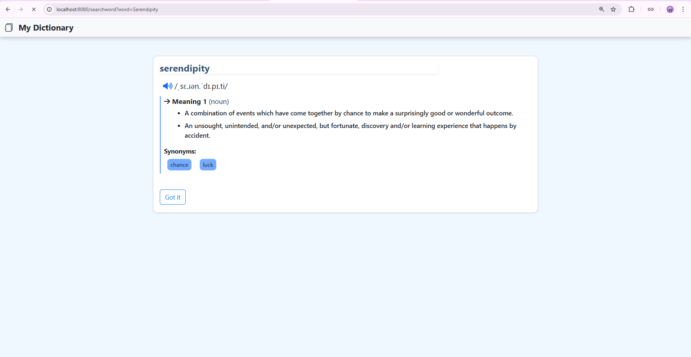
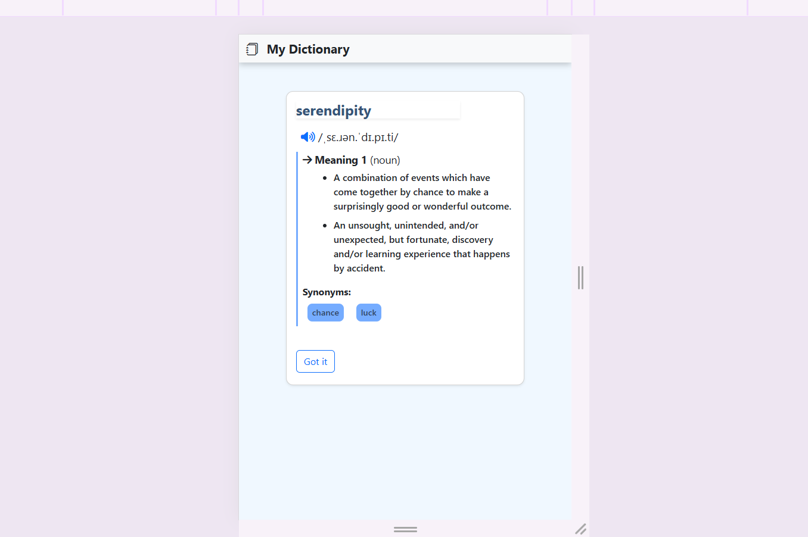

# 📘 My Dictionary App

My Dictionary App is a simple and user-friendly **web-based English dictionary application**. It allows users to search for any English word and instantly view its definitions, parts of speech, phonetics, synonyms, and usage examples using a public Dictionary API.

💻 **GitHub Repository:** [https://github.com/muktijain/My-Dictionary-App](https://github.com/muktijain/My-Dictionary-App)

---

## ✨ Features

* 🔍 Search for any English word
* 📖 View **multiple meanings** and definitions
* 🧠 Displays **parts of speech** (noun, verb, adjective, etc.)
* 🔊 Audio pronunciation with phonetics
* 📝 Example sentences for better understanding
* 🔁 Shows top synonyms
* 🎨 Clean, readable, and fully styled result cards
* 📱 Fully **responsive UI** (desktop, tablet & mobile)
* ⚠️ Graceful error handling for invalid or missing words

---

## 🔧 Tech Stack

### Backend

* **Node.js** – JavaScript runtime environment
* **Express.js** – Web framework for routing and server logic

### Frontend

* **EJS** – Template engine for dynamic rendering
* **HTML5 & CSS3**
* **Bootstrap 5** – Responsive and modern UI design

### API & Tools

* **Axios** – For making HTTP requests
* **Dictionary API** – [https://dictionaryapi.dev/](https://dictionaryapi.dev/)

---

## 📱 Responsive Design

The application is built with a **mobile-first approach** and works seamlessly across all devices:

✔ Desktop
✔ Tablet
✔ Mobile

Bootstrap’s grid system and responsive utilities ensure a consistent user experience.

---

## 🚀 Getting Started (Run Locally)

### Prerequisites

* Node.js (v14 or higher)

### Installation

```bash
git clone https://github.com/muktijain/My-Dictionary-App.git
cd My-Dictionary-App
npm install
```

### Run the Application

```bash
node server.js
```

Visit: `http://localhost:8080`

---

## 📸 Screenshots / Demo

| Desktop | Mobile |
|--------|--------|
|  |  |


## 🧠 What I Learned

* Integrating third-party APIs using Axios
* Server-side rendering with EJS
* Structuring Express applications
* Handling API errors gracefully
* Building responsive UIs with Bootstrap

---

## 👤 Author

**Mukti Jain**

---

## ⭐ Feedback

If you found this project helpful or interesting, feel free to star the repository or share your feedback!
